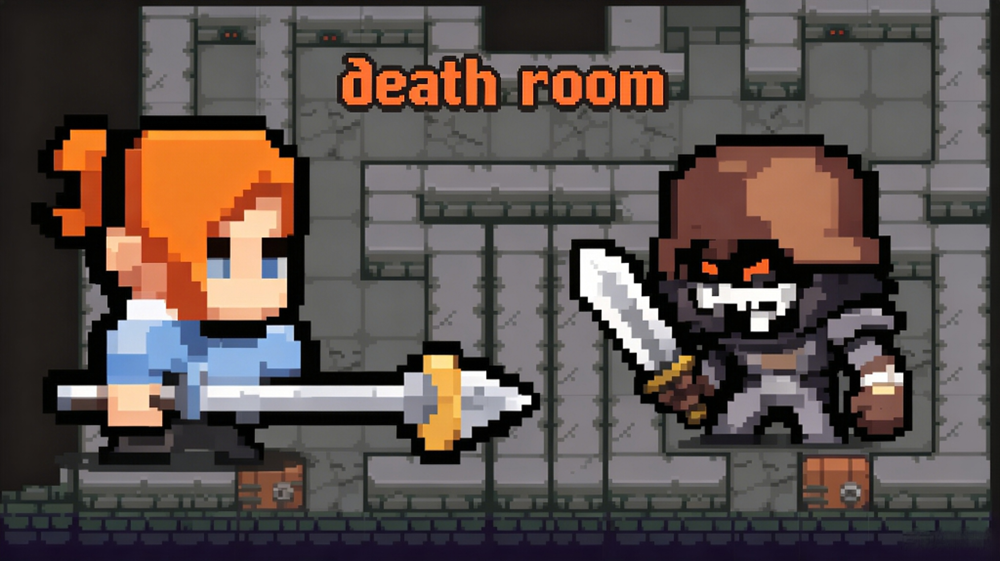

# Death Room

A turn-based puzzle game built with Cocos Creator 3.8.6. Navigate a grid-based map, defeat enemies, and reach the door to advance through 21 levels.

> Please note that more than half of the code in this project was completed with the assistance of DeepSeek!

https://github.com/user-attachments/assets/e6fbb69e-e0c0-425d-b6db-c930bdd80a66

## How to Play

- Tap/click on screen to start
- Use directional controls to move the player
- Defeat all enemies on each level
- Reach the door to proceed to the next level

## Play Online

https://precious-tanuki-7ca972.netlify.app/

## Android

Download in the [releases](https://github.com/zmrlft/death-room/releases)

## Tech Stack

- Engine: Cocos Creator 3.8.6
- Language: TypeScript
- Platform: Web (HTML5) and Android

## Docs

[google-admob](docs/google-admob-android-integration.md)
